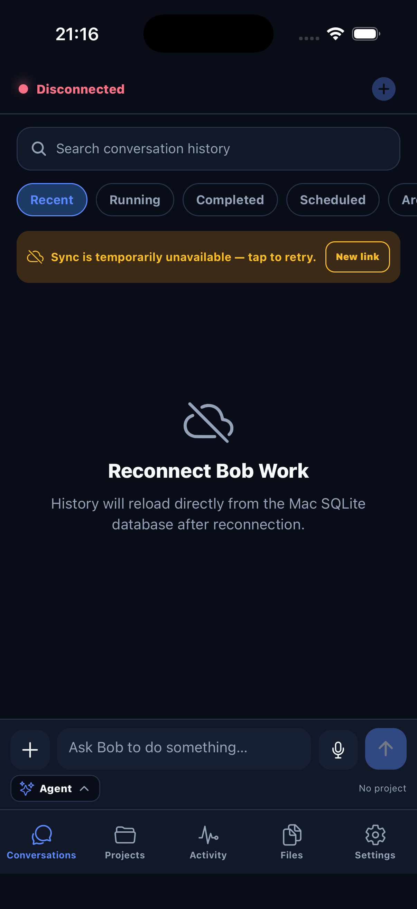

# BobMobile

BobMobile est le client iOS/Android de Bob Work. Il permet de suivre et piloter depuis un téléphone le moteur Bob Shell qui continue de s’exécuter sur le Mac.

Le desktop reste la source de vérité : BobMobile ne possède ni seconde base de conversations, ni copie indépendante des projets, plugins ou autorisations.

## Fonctionnalités

- conversations, projets et historique synchronisés depuis BobDesktop ;
- streaming de la réponse et de l’activité Bob via Server-Sent Events ;
- lancement, arrêt, reprise et validation des tâches ;
- sélection de modes, plugins, skills, MCP, APIs et bases autorisés ;
- pièces jointes, messages vocaux, fichiers produits et previews HTML ;
- cartes interactives, plusieurs points d’intérêt et itinéraires ;
- position actuelle opt-in utilisable comme origine d’itinéraire ;
- notifications push et indicateurs de conversations non lues ;
- gestion des chats archivés ;
- interface française, anglaise et espagnole.



## Architecture

```text
┌──────────────────────── Application Expo ────────────────────────┐
│ App.tsx                                                          │
│ navigation entre conversations, projets, activité, fichiers      │
│ et réglages                                                       │
├───────────────────────────────────────────────────────────────────┤
│ Écrans                           Composants                        │
│ ChatScreen                      Prompt / modales / cartes          │
│ ConversationsScreen             previews WebView / markdown       │
│ ProjectsScreen                  barres de statut / sélecteurs      │
│ FilesScreen · SettingsScreen                                     │
├───────────────────────────┬───────────────────────────────────────┤
│ AppContext                │ BobApi                                │
│ session · cache mémoire   │ REST JSON · uploads · SSE             │
│ langue · état réseau      │ jeton Bearer                          │
├───────────────────────────▼───────────────────────────────────────┤
│ SecureStore : lien et jeton          Expo modules :               │
│ aucune base métier locale            location · audio · fichiers  │
└───────────────────────────┬───────────────────────────────────────┘
                            │ HTTPS
                            ▼
                 API distante de BobDesktop
                            │
                  SQLite · Bob Shell · MCP
```

### Flux d’une conversation

```text
prompt mobile
    │ POST /conversations/:id/messages
    ▼
BobDesktop lance Bob Shell
    │ événements SSE : texte, activité, tâche, approbation
    ▼
BobMobile met à jour l’écran
    │ GET /messages et /sync
    ▼
état final relu depuis la base SQLite du Mac
```

Les rafraîchissements REST réconcilient toujours l’interface avec l’état persistant du Mac. Les événements SSE accélèrent l’affichage, mais ne constituent pas une seconde source de vérité.

## Cartes et localisation

Les résultats `kind: "bob-map"` produits par les outils cartographiques du desktop sont détectés dans les activités persistées et affichés dans une carte WebView :

- pins rouges numérotés pour les lieux et points d’intérêt ;
- repères A/B pour un itinéraire ;
- point bleu réservé à la position actuelle ;
- tracé et cadrage automatiques de tous les points.

La localisation est désactivée par défaut. Son activation dans **Réglages → Position actuelle** demande l’autorisation système en premier plan, puis envoie la coordonnée au BobDesktop connecté. La désactivation efface la coordonnée côté desktop. Aucune collecte en arrière-plan n’est demandée.

## Connexion à BobDesktop

1. Ouvrir Bob Work sur le Mac.
2. Aller dans **Réglages → Télécommande**.
3. Activer la télécommande et attendre le statut prêt.
4. Copier le lien sécurisé puis le coller dans BobMobile.

Le jeton se trouve dans le fragment du lien, est conservé avec SecureStore et accompagne les requêtes sous forme de Bearer token. Désactiver ou recréer la télécommande révoque le lien précédent.

## Prérequis

- Node.js 22 recommandé ;
- npm ;
- Xcode et un simulateur iOS pour le développement macOS ;
- Android Studio pour un émulateur Android ;
- une instance BobDesktop accessible pour les scénarios réels.

## Installation et développement

Depuis la racine Git :

```bash
cd BobMobile
npm install
npm start
```

Autres commandes :

```bash
npm run ios       # génération/build natif et lancement iOS
npm run android   # génération/build natif et lancement Android
npm run web       # client web de développement
npm run mock      # serveur simulé local
```

Pour une connexion automatique réservée au développement, utilisez les variables Expo prévues dans un fichier `.env` local. Ne commitez jamais le lien ni son jeton.

## Structure

```text
BobMobile/
├── App.tsx                    navigation principale
├── src/
│   ├── api.ts                 client REST authentifié
│   ├── context/AppContext.tsx connexion, synchronisation et SSE
│   ├── screens/               écrans fonctionnels
│   ├── components/            UI réutilisable et carte
│   ├── types.ts               contrats distants
│   ├── i18n.ts                catalogues fr/en/es
│   └── visualizationHtml.ts   sécurisation des previews HTML
├── assets/                    images et icônes
├── locales/                   métadonnées natives localisées
├── scripts/                   mock serveur et utilitaires
├── app.json                   configuration Expo et permissions
└── package.json
```

`ios/`, `.expo/`, `dist/`, `build/` et `node_modules/` sont des sorties locales régénérables et ne sont pas versionnés.

## Release iOS sans résidus natifs

```bash
pnpm ios:release:simulator  # binaire Release non signé, contrôlable localement
pnpm ios:release:archive    # archive appareil signée pour distribution
```

La routine supprime les sorties Expo/Xcode du projet, régénère entièrement `ios/` avec
`expo prebuild --clean`, puis compile dans un DerivedData isolé sous `.release/`. La
certification finale vérifie la version et le bundle id, refuse les marqueurs Dev Client,
Metro et écrans de développement, et confirme que `ExpoLocation` est réellement lié au
binaire natif. Elle évite ainsi qu’un ancien projet iOS ou un ancien pod reste présent
alors que le JavaScript utilise une version plus récente.

## Tests

```bash
npm run typecheck
npm run test:i18n
npm run test:markdown
npm run test:visualization
npm run test:maps
npm run doctor
```

Avant une livraison, validez au minimum une connexion réelle au Mac, l’envoi d’un prompt, une approbation, l’ouverture d’un artefact et l’activation/désactivation de la localisation sur simulateur ou appareil.

## Sécurité et confidentialité

- le token de connexion est stocké dans SecureStore ;
- les secrets d’intégration restent sur BobDesktop ;
- les previews HTML bloquent la navigation non autorisée ;
- les permissions photo, microphone, notification et localisation sont demandées au moment utile ;
- la position n’est jamais activée en arrière-plan ;
- se déconnecter supprime la session mobile locale, tandis que couper la télécommande révoque l’accès côté Mac.

## Dépannage

- **Lien expiré** : recréer le lien dans BobDesktop puis reconnecter BobMobile.
- **Historique indisponible** : vérifier que BobDesktop tourne et que le tunnel est prêt.
- **Position refusée** : réactiver la permission de BobMobile dans les réglages iOS/Android puis toucher *Actualiser*.
- **Modules natifs ajoutés** : relancer `npm run ios` ou `npm run android`; un simple refresh Expo peut être insuffisant.
- **Preview vide** : vérifier l’accès réseau aux ressources autorisées et consulter les logs Metro/WebView.
