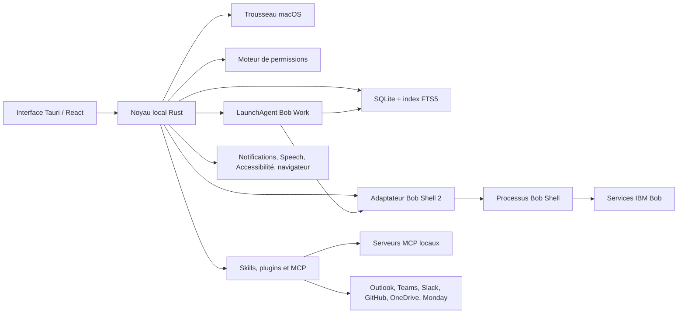

# Bob Work — plan d’implémentation complet pour Bob Shell 2

**Référence d’exécution auditée :** Bob Shell 2.0.0, publié le 6 août 2026  
**Application IBM présente sur la machine :** IBM Bob IDE 2.0.2  
**Principe produit :** données de Bob Work locales par défaut ; les requêtes envoyées à IBM Bob et aux intégrations réseau restent nécessairement distantes.

> **Mise à jour 0.1.4 (9 août 2026)** — La stratégie de secrets a changé : aucune dépendance au Trousseau et aucun coffre local. La clé Bob est saisie pour la session active uniquement et doit être saisie à nouveau après un redémarrage complet.

## 1. Décisions de produit

Bob Work n’est pas une copie graphique de ChatGPT Work. Il reprend ses grands parcours — conversations, projets, tâches, planifications, permissions, extensions et sources — tout en exposant les capacités réellement disponibles de Bob Shell. L’interface ne propose jamais un modèle LLM : elle propose les modes Bob détectés sur la machine.

Les cinq règles structurantes sont :

1. **Local-first vérifiable.** SQLite, historiques, index de recherche, pièces jointes, journaux, plugins et préférences restent sur le Mac. Aucun service Bob Work distant n’est introduit.
2. **Bob Shell possède l’authentification IBM.** Bob Work lance le flux navigateur du Shell et observe son état. L’application ne demande ni mot de passe IBM, ni accès direct à l’Identity Provider, ni jeton de session privé.
3. **Détection plutôt que supposition.** Les commandes, formats d’événements, modes, outils MCP et informations de quota sont sondés au démarrage. Toute fonction absente reçoit un état explicite et une solution de repli.
4. **Permissions en profondeur.** Une autorisation doit être permise par macOS, Bob Work et Bob Shell. Une autorisation permanente est spécifique à une ressource et révocable.
5. **Activité explicable, pas chaîne de pensée.** L’utilisateur voit le plan, les étapes, les outils, fichiers, commandes, sources, entrées, sorties et validations. Les raisonnements internes cachés du modèle ne sont pas exposés.

## 2. Limites honnêtes

| Demande | Résultat visé | Limite incompressible |
|---|---|---|
| Fonctionnement local | Toutes les données applicatives restent locales | L’inférence IBM Bob, le Web et les connecteurs utilisent le réseau |
| Connexion IBM simple | Bouton « Continuer avec IBM », navigateur système, retour automatique à l’app | Sans client OAuth IBM enregistré, Bob Work ne doit pas intercepter le callback de l’IdP ; le Shell termine son propre flux |
| Planifié écran verrouillé | Oui, avec un agent macOS et le Mac éveillé | Aucun processus ne tourne pendant extinction ; pendant sommeil profond, exécution au réveil selon la politique choisie |
| Planifié app fermée | Oui via LaunchAgent signé et helper minimal | Requiert installation/activation explicite du helper et session Bob non expirée |
| Transcription Apple | `SFSpeechRecognizer`, dictée locale quand disponible | Pas d’API Apple privée ; disponibilité on-device dépend de la langue et du Mac |
| Consommation restante | Affichage si Shell/API renvoie une donnée structurée | Sinon indiquer « non communiqué par IBM Bob », sans inventer de pourcentage |
| Raisonnement | Journal d’activité et résumé de décision | Pas de chaîne de pensée privée ; uniquement les événements/outils explicitement émis |
| Computer use / Chrome | Extension locale ou MCP, autorisations Accessibilité/Automation | Consentements macOS obligatoires ; certaines actions Chrome nécessitent extension ou profil utilisateur actif |
| Connecteurs préinstallés | Catalogue et assistants de configuration intégrés | Chaque fournisseur exige ses propres identifiants/OAuth et, souvent, un serveur MCP ; aucun compte n’est connecté par défaut |
| Compatibilité ChatGPT/Claude | Import des exports documentés et conservation du brut | Les formats propriétaires peuvent changer ; l’importeur doit être versionné et signaler les éléments non reconnus |

## 3. Architecture cible

### 3.1 Frontend

- Navigation : Accueil, nouveau chat, projets, tâches, planifié, plugins, intégrations, extensions/MCP, réglages.
- Composer unique : texte, dictée, fichiers/dossiers, projet, mode Bob, mentions `@plugin` et `@skill`.
- Panneau d’activité : étapes, appels d’outil, sources, fichiers modifiés, entrées/sorties, demandes d’autorisation.
- État global persistant : session active, tâches actives et compteurs ; aucune tâche ne disparaît en changeant de vue.
- Accessibilité : navigation clavier complète, contraste AA, réduction des animations, VoiceOver.

### 3.2 Noyau local

- Une file de tâches persistante, avec récupération après crash.
- Un adaptateur Shell versionné (`ShellProfile`) contenant : chemin, version, commandes supportées, format de sortie, modes, outils, état d’authentification et quota éventuel.
- Un bus d’événements typé transformant les sorties Shell en événements : texte, étape, outil, source, permission, usage, erreur et fin.
- Un moteur de politique qui calcule `allow`, `ask` ou `deny` avant l’appel du Shell puis revalide les événements sensibles.
- Un registre d’extensions unifié : plugin Bob Work, skill Bob et serveur MCP restent des objets distincts mais peuvent être associés.

### 3.3 Agent macOS

- LaunchAgent utilisateur démarré à la connexion, jamais en root.
- Accès à la même base via une file atomique ; verrou exclusif par exécution.
- Exécute les planifications lorsque l’UI est fermée ou l’écran verrouillé.
- Enregistre le résultat puis envoie une notification macOS ; l’ouverture de la notification cible la tâche.
- Si le Mac dormait : applique `ignorer`, `exécuter au réveil` ou `demander`.

## 4. Modèle de données à ajouter

- `task_runs` : une ligne par tentative, état, dates, PID, session Shell, erreur et synthèse.
- `task_events` : journal ordonné de texte/étape/outil/source/permission/usage.
- `task_io` : entrées et sorties typées, chemin, hash, taille et aperçu.
- `schedule_runs` : historique de toutes les occurrences planifiées.
- `attachments` : fichier/dossier, signet macOS, copie ou référence, MIME, hash et indexation.
- `permission_grants` : sujet, action, portée, ressource, expiration, provenance et révocation.
- `skills` : skills détectés, installés ou créés, origine, version, activation et contenu.
- `mcp_servers` : transport, commande/URL, état, outils découverts et références Keychain.
- `integration_accounts` : fournisseur, compte, scopes, serveur MCP associé et santé.
- `conversation_imports` : fournisseur, version, fichier brut, erreurs et correspondances.
- `usage_snapshots` : métriques structurées avec date et provenance.
- FTS5 sur titres, messages, projets, tâches, sources et artefacts.

Toutes les migrations sont additives et idempotentes. Les secrets ne figurent jamais dans SQLite.

## 5. Fonctionnalités, comportement exact et acceptation

### 5.1 Détection, installation et connexion Bob

1. Rechercher `bob` dans le PATH, les emplacements npm/pnpm et un chemin choisi par l’utilisateur ; aucun mock en production.
2. Lire `bob --version` puis sonder l’aide et, si disponible, une commande de capacités.
3. Vérifier l’intégrité du paquet Shell officiel avant toute installation et afficher la version/éditeur.
4. « Continuer avec IBM » lance le mode interactif du Shell dans un pseudo-terminal. Le navigateur et le callback restent gérés par Bob.
5. Observer une commande sans effet pour confirmer l’authentification ; l’existence d’un fichier local ne suffit pas.
6. API key : option distincte, stockée dans Keychain et injectée uniquement dans l’environnement du processus (`BOB_API_KEY` pour Shell 2.0.0).
7. Afficher dans Réglages : version, chemin, auth active, méthode, dernière vérification et capacités indisponibles.

### 5.2 Modes Bob

- Modes natifs de base : Agent, Plan, Ask.
- Scanner les catalogues `custom_modes.yaml` globaux et propres aux projets.
- Afficher nom, icône, description et groupes d’outils. Recherche instantanée comme dans IBM Bob.
- Conserver le `slug` réel et le transmettre au Shell ; ne pas transformer un mode personnalisé en `agent`.
- Modes produit comme Présentation ou Orchestrateur : lier à un mode Bob détecté ou afficher « adaptation Bob Work ».
- Le catalogue est rafraîchi sans redémarrage de l’application.

### 5.3 Conversations et projets

- Création, renommage, épinglage, archivage, suppression récupérable et recherche plein texte.
- Projet : dossier racine, instructions, mémoire, langue, mode par défaut, fichiers autorisés, plugins, skills, intégrations et politique de permissions.
- Le contexte envoyé à Bob combine, dans cet ordre : instructions globales, instructions projet, mode, plugins/skills mentionnés, historique résumé, pièces jointes puis message.
- Les mentions `@` sont résolues en identifiants ; l’interface montre les éléments injectés avant l’envoi.
- Import/export local : Bob Work JSON, Markdown, Claude et ChatGPT ; rapport détaillé des éléments ignorés.

### 5.4 Pièces jointes

- Bouton et glisser-déposer pour fichiers **et dossiers**.
- Choix « référencer à son emplacement » ou « copier dans le projet ».
- Signets de sécurité macOS pour conserver l’accès après redémarrage.
- Aperçu, retrait, détection du type, taille, hash et avertissement pour données sensibles.
- Le Shell reçoit les chemins via le mécanisme supporté (`--include-directories` ou prompt sécurisé), jamais par concaténation de commande shell.

### 5.5 Tâches

- Chaque travail Agent/Planifié crée une tâche persistante avant le lancement.
- États : file, démarrage, en cours, information requise, permission requise, pause, terminé, échec, annulé.
- Loader rotatif indéterminé tant que Bob ne fournit pas un progrès fiable ; barre chiffrée uniquement avec données réelles.
- Vue détail : objectif, mode, projet, durée, tentatives, plan, événements, entrées, sorties, sources, fichiers touchés, permissions et coût/usage éventuel.
- Actions : arrêter, reprendre si supporté, relancer, dupliquer, ouvrir la conversation et exporter le journal.
- Le changement de page ou redémarrage de la WebView ne perd pas l’état : le backend est la source de vérité.
- Notification locale succès/échec avec navigation vers le détail.

### 5.6 Planifié

- CRUD complet, fuseau détecté, récurrence guidée et expression cron avancée validée.
- Exécution immédiate de test, pause, dupliquer, historique paginé, détails des entrées/sorties/sources.
- Politiques hors ligne et chevauchement effectivement appliquées.
- LaunchAgent installé avec consentement ; écran verrouillé pris en charge si le Mac est éveillé.
- Auth expirée ou permission nécessaire : occurrence `attention requise`, notification et aucun contournement automatique.

### 5.7 Permissions

Portées disponibles : une fois, cette tâche, cette conversation, ce projet, toujours pour cette ressource. Actions : lecture/écriture/suppression de fichier, commande, réseau/domaine, presse-papiers, microphone, notifications, Accessibilité, Automation/Chrome et outil MCP.

La fenêtre d’autorisation présente : action lisible, commande exacte si applicable, chemins/domaines, raison, risque, capacité d’annulation et choix de portée. Les règles globales, projet et tâche sont combinées selon le principe le plus restrictif. Toutes les décisions sont auditées et révocables dans Réglages.

### 5.8 Plugins, skills, intégrations et MCP

- **Plugin Bob Work** : paquet local avec manifeste, instructions, permissions, éventuels skills et serveurs MCP.
- **Skill Bob** : instruction spécialisée dans le format réellement accepté par Shell 2 ; import, création par chat, modification, validation, version, activation et suppression récupérable.
- **MCP** : CRUD transport stdio/HTTP, variables secrètes Keychain, test de connexion, découverte d’outils, activation par projet et affichage des permissions.
- Le créateur conversationnel génère un brouillon, affiche le manifeste et la différence, valide le risque, puis demande confirmation avant installation.
- Les mises à jour sont atomiques avec sauvegarde et restauration.
- Catalogue initial : Outlook Email, Teams, Outlook Calendar, Monday.com, Slack, GitHub et OneDrive. Chaque fiche distingue clairement « disponible », « à configurer », « connecté », « erreur ».
- Computer Use et Chrome sont des extensions locales à haut risque, désactivées par défaut et limitées à des actions/domaines approuvés.

### 5.9 Web, sources et activité

- Le mode Web active uniquement un outil navigateur/MCP effectivement détecté.
- Chaque source possède titre, URL/chemin, date d’accès, outil et association au passage produit.
- Les sources, entrées et sorties sont consultables par message et par tâche.
- L’activité affiche les événements explicitement retournés : plan, appel d’outil, validation et résultat. Aucun texte ne sera présenté comme « pensée secrète » du modèle.

### 5.10 Voix, langue, thème, usage et notifications

- Langue `Automatique` initialisée depuis macOS et détectée par conversation ; forçage global/projet possible.
- Thèmes système/clair/sombre appliqués immédiatement.
- Dictée via API Apple publique, consentement Microphone + Reconnaissance vocale, transcription éditable avant envoi.
- Usage : dernière valeur et date si Bob l’expose ; sinon état indisponible explicite.
- Notifications configurables par type, avec test, son et action d’ouverture.

## 6. Organisation complète des réglages

1. **Général** : langue, thème, démarrage, barre de menus, raccourci, notifications.
2. **Bob Shell** : version, chemin, mise à jour, connexion IBM/API key, compte, diagnostic, capacités.
3. **Modes** : mode par défaut, catalogue détecté, modes personnalisés.
4. **Instructions et mémoire** : prompt global, langue des réponses, mémoire et rétention.
5. **Permissions** : politique par défaut, autorisations persistantes, audit, dossiers approuvés.
6. **Tâches et Planifié** : concurrence, durée, reprise, comportement veille/réveil, LaunchAgent.
7. **Plugins et Skills** : installés, mises à jour, répertoires, création/import/export.
8. **Intégrations et MCP** : comptes, serveurs, outils, secrets, test de santé.
9. **Web et contrôle de l’ordinateur** : navigateur, Chrome, domaines, Accessibilité, Automation.
10. **Voix** : microphone, langue, on-device, raccourci.
11. **Données locales** : chemin, taille, rétention, indexation, imports/exports, effacement.
12. **Apparence et accessibilité** : taille, densité, animations, contraste.
13. **Avancé** : logs expurgés, canal de mise à jour, diagnostics et fonctionnalités expérimentales.

## 7. Phases d’implémentation

### Phase 0 — sécurité et vérité du Shell

- Supprimer fuite de clé temporaire et mock de détection.
- Télécharger/vérifier Shell 2.0.0, documenter ses commandes réelles.
- Créer `ShellProfile`, détection fiable d’authentification et parseur d’événements tolérant.
- Corriger variables d’environnement et arguments sans shell intermédiaire.

### Phase 1 — fondations de travail

- Migrations tâche/événements/IO/sources/permissions/FTS.
- Relier chaque session chat à une tâche ; récupération et loader global.
- Tâches : liste, détail, historique, relance, annulation et notifications.
- Recherche globale de conversations.

### Phase 2 — contexte utilisateur

- Pièces jointes fichiers/dossiers, glisser-déposer et permissions de chemin.
- Projets complets, instructions globales/projet et mentions `@`.
- Catalogue dynamique des modes, skills et plugins.

### Phase 3 — automatisation robuste

- Planifications enrichies, occurrence/historique, test immédiat et politiques.
- Helper LaunchAgent, notifications et exécution écran verrouillé.
- Gestion auth/permission bloquante sans contournement.

### Phase 4 — extensions

- Registre skills/plugins/MCP et CRUD complet.
- Catalogue des sept connecteurs avec assistants réels de configuration.
- Chrome/computer use avec consentements macOS et politique restrictive.

### Phase 5 — finition produit

- Voix Apple, thèmes/langues, quota conditionnel, import/export.
- Accessibilité, diagnostics, migration des anciennes données.
- Tests end-to-end avec vrai Shell, signature/notarisation et DMG universel.

## 8. Stratégie de validation

- Tests unitaires pour migrations, modes, permissions, parsing Shell, imports et expressions planifiées.
- Tests d’intégration sur un faux exécutable uniquement injecté explicitement par le test, jamais détecté en production.
- Tests réels Shell 2.0.0 : login, Ask/Plan/Agent, mode personnalisé, annulation, erreur auth, source, outil et permission.
- Tests macOS : écran verrouillé, app fermée, sommeil/réveil, notification, microphone, dossiers signés et Accessibilité.
- Tests de sécurité : secrets absents des logs/DB, traversée de chemin, injection d’argument, serveur MCP malveillant et révocation.
- Critère de sortie : aucune fonction affichée comme active sans backend réel ou message de limite explicite.

## 9. Definition of Done

La version est livrable lorsque : le DMG s’installe sur un Mac propre, le flux IBM fonctionne sans IdP intégré, les modes réels sont détectés, une tâche survit aux changements de vue, une planification s’exécute app fermée et écran verrouillé lorsque le Mac reste éveillé, toutes les actions sensibles demandent la bonne permission, et l’utilisateur retrouve pour chaque exécution son historique, ses sources, ses entrées et ses sorties.
